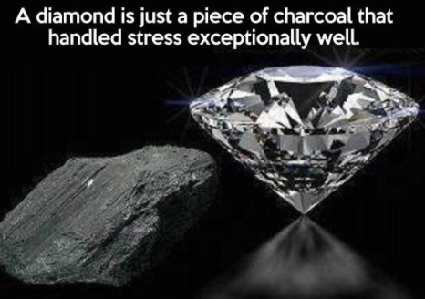

# Diamonds competition: predicting prices!

### **Dataset utilizado**

Para el análisis utilizamos un dataset con las diferentes características de varios diamantes y sus precios (para entrenar nuestro modelo). Además de ese dataset, se nos proporcionó otro sin la columna que teníamos que predecir (precio).
Aparte de los datasets con los que trabajar, tuvimos que crear el dataset de nuestra `submission` compuesto por la `id` del diamante cuyo precio queríamos predecir y el resultado estimado por nuestro modelo previamente entrenado.

### Variables con las que trabajamos:

En el proyecto trabajamos tanto con variables numéricas como con categóricas. Estas variables eran el tamaño del diamante, su volumen descompuesto en sus diferentes ejes en el espacio, la claridad del diamante, su color, el corte del diamante, etc.

Para poder trabajar con las variables categóricas, las convertí a ordinales cambiando los valores cualitativos a numéricos según si la categoría era mejor o peor. Por ejemplo:

```
clarity_dict = {

    "IF":8,
    "VVS1":7,
    "VVS2":6,
    "VS1":5,
    "VS2":4,
    "SI1":3,
    "SI2":2,
    "I1":1
}

df["clarity"] = df["clarity"].apply(lambda x: clarity_dict[x])
```
En el código superior asigné 8 al mejor valor para la claridad de un diamante y 1 al peor, siendo el resto de valores puntuaciones intermedias para la claridad.

Para las numéricas del volumen, creé una nueva columna llamada "Volumen" donde multipliqué los ejes `x`,`y` y `z` para conseguir unificar estos tres valores y trabajar simultáneamente con un menor uso de memoria.

### Requerimientos del proyecto

Para que el proyecto se considerase válido, el RMSE(root mean squared error) tenía que ser menor de 1000. Mi mejor resultado fue un RMSE de ~600.

### Dividiento los datos

Para trabajar con los datos y poder entrenarlos, usé el método de `sklearn` train-test-split y dividí los datos en una proporción de un 80% para el entrenamiento del modelo y un 20% para testear su funcionamiento.

### Modelos utilizados

Algunos modelos que utilicé fueron:
- LinearRegression
- KNN() con GridSearchCV
- RandomForest

El que me dio mejor resultado fue `RandomForest()` con el RMSE más bajo.

Además probé:

- Transformaciones logarítmicas
- Lasso
- LassoLars
- Ridge
- LogisticRegression
- DecisionTreeRegressor

Varios de estos modelos ni siquiera los guardé en la notebook de Jupyter porque los resultados eran malos (aproximadamente 1200 de RMSE).


### Posibles mejoras para el proyecto:

Teniendo más tiempo para que el ordenador entrenase los modelos, me habría gustado entrenarlos haciendo más uso del GridSearch y utilizando dummies para categorizar todas las variables.